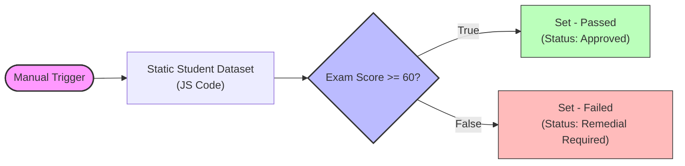
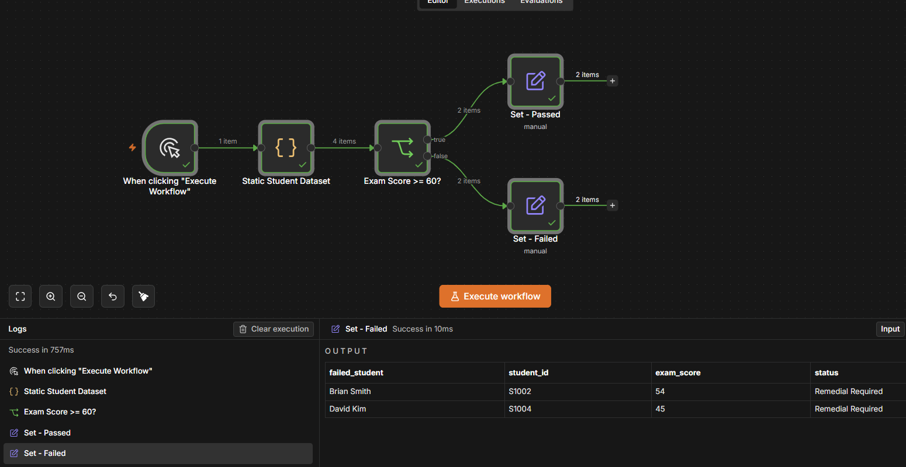

# Student Exam Score Filter Pipeline

An automated n8n workflow designed to filter and process student exam scores. This pipeline determines whether a student has passed an exam (score $\ge 60$) or requires remedial support (score $< 60$), standardizing the output structure for each category.

## Workflow Overview

The workflow processes student records through a 4-step logical flow:



## Dataset & Nodes Description

### 1. Manual Trigger
* **Name:** `When clicking "Execute Workflow"`
* **Purpose:** Starts the execution manually from the n8n editor.

### 2. Static Student Dataset (Code Node)
* **Name:** `Static Student Dataset`
* **Type:** Javascript Code
* **Input Data:**
  
  | Student Name | Student ID | Exam Score |
  | :--- | :--- | :--- |
  | Alice Johnson | S1001 | 88 |
  | Brian Smith | S1002 | 54 |
  | Carla Mendes | S1003 | 60 |
  | David Kim | S1004 | 45 |

### 3. Conditional Filter (IF Node)
* **Name:** `Exam Score >= 60?`
* **Condition:** `exam_score` $\ge$ `60` (Number operation: Greater Than or Equal)
* **Routing:**
  * **True Branch:** Scores 60 and above.
  * **False Branch:** Scores below 60.

### 4. Output Configuration (Set Nodes)

#### Branch A: Passed
* **Name:** `Set - Passed`
* **Mapped Fields:**
  * `passed_student`: `{{ $json.student_name }}`
  * `student_id`: `{{ $json.student_id }}`
  * `exam_score`: `{{ $json.exam_score }}`
  * `status`: `"Approved"`

#### Branch B: Failed
* **Name:** `Set - Failed`
* **Mapped Fields:**
  * `failed_student`: `{{ $json.student_name }}`
  * `student_id`: `{{ $json.student_id }}`
  * `exam_score`: `{{ $json.exam_score }}`
  * `status`: `"Remedial Required"`

---

## Execution Results

Upon execution, the workflow routes and filters the student dataset as follows:

### Passed Results (True Output)
```json
[
  {
    "passed_student": "Alice Johnson",
    "student_id": "S1001",
    "exam_score": 88,
    "status": "Approved"
  },
  {
    "passed_student": "Carla Mendes",
    "student_id": "S1003",
    "exam_score": 60,
    "status": "Approved"
  }
]
```

### Failed/Remedial Results (False Output)
```json
[
  {
    "failed_student": "Brian Smith",
    "student_id": "S1002",
    "exam_score": 54,
    "status": "Remedial Required"
  },
  {
    "failed_student": "David Kim",
    "student_id": "S1004",
    "exam_score": 45,
    "status": "Remedial Required"
  }
]
```

### Visual Verification
Below is the execution result visualized within n8n showing the nodes running successfully and producing the filtered student output:


